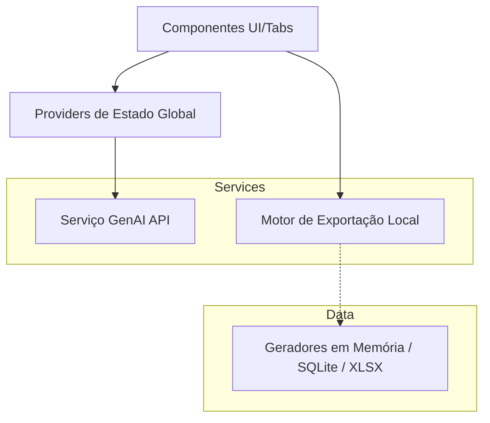

<div align="center">
  <h1>🧬 dbfakeai</h1>
  <p><strong>O Gerador Definitivo de Dados Sintéticos e Schemas Relacionais via IA</strong></p>
  
  [](https://reactjs.org/)
  [](https://vitejs.dev/)
  [](https://www.typescriptlang.org/)
  [](https://tailwindcss.com/)
  [](#)
</div>

<br/>

**dbfakeai** é uma ferramenta open-source avançada projetada para engenheiros de software e analistas de dados. Abandone scripts pesados; gere massas de dados sintéticos complexos e realistas usando o raciocínio profundo de LLMs, arquitetado 100% no cliente (Zero-Backend).

---

## ⚡ Por que escolher o dbfakeai?

*   🧠 **Engenharia de Prompt Nativa:** Descreva sua necessidade ("Tabela de pedidos com status variados") e a IA não só criará o schema SQL perfeito, mas também entenderá as restrições invisíveis do seu negócio para popular os dados.
*   📦 **Múltiplos Formatos de Saída:**
    *   **SQL:** Script com `CREATE TABLE` e `INSERT`.
    *   **SQLite (.db):** Banco de dados relacional encapsulado em arquivo físico via VFS.
    *   **JSON / CSV / Excel:** Perfeito para ingestão NoSQL ou Data Science.
*   🔒 **Arquitetura Zero-Backend:** O projeto processa o motor GenAI e armazena chaves diretamente no LocalStorage e Memória RAM do seu navegador. Zero servidores intermediários coletando ou salvando seus bancos de dados criados. Nenhuma telemetria maliciosa enviada.

---

## 🏗️ Arquitetura Clean-FrontEnd (Código-Fonte Modular)

A base de código deste repositório foi reescrita utilizando **Clean Architecture** fragmentada para o ecossistema React, abstraindo lógicas de negócio dos ciclos de vida da interface gráfica.



---

## 🚀 Como Executar Localmente

### 1. Preparando o Ambiente
Para clonar e rodar localmente, você precisa ter instalado o [Node.js](https://nodejs.org/) (versão 18 ou superior).

```bash
# 1. Instale as dependências
npm install

# 2. Inicie o Servidor de Desenvolvimento Vite
npm run dev
```

### 2. Configurando a Chave de Inteligência
Ao abrir o painel em `http://localhost:3000`, insira sua chave da API do Google Gemini. Caso prefira fixá-la na compilação para ambientes fechados, crie o arquivo `.env.local` na raiz:
```env
GEMINI_API_KEY="SUA_CHAVE_AQUI"
```

## 🛠️ Modos de Compilação NPM

| Comando | Descrição |
| :--- | :--- |
| `npm run dev` | Sobe o ambiente interativo HMR na porta 3000. |
| `npm run build` | Empacota, minifica (Rollup) e exporta os *assets* de produção para a pasta `/dist`. |
| `npm run preview` | Sobe um servidor HTTP apontando para o `/dist` empacotado. |
| `npm run lint` | Executa a compilação cruzada do TypeScript (`tsc --noEmit`) sem gerar arquivos (Strict Check). |

---

<div align="center">
Criado com 🩵 usando React, Vite e Inteligência Artificial.
</div>
